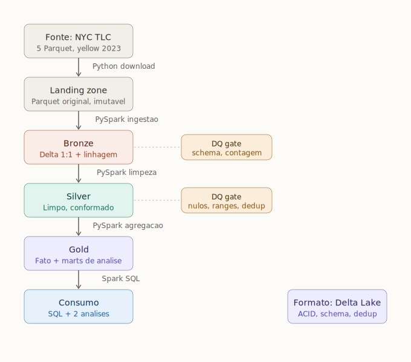

# Case Técnico — Data Architect (iFood)

Ingestão, disponibilização e análise dos dados de corridas de táxi de NY (NYC TLC,
**yellow taxi, janeiro a maio de 2023**, ~16,2 milhões de corridas) em um data lake
com arquitetura medallion, camada de consumo via SQL e data quality gates entre as
camadas.

## Arquitetura



Pipeline medallion sobre Delta Lake, com PySpark em todas as transformações e data
quality gates explícitos entre as camadas:

| Camada | Conteúdo | PySpark |
|---|---|---|
| **Landing** | 5 Parquet originais da TLC (1:1 com a fonte) | — (download Python) |
| **Bronze** | Delta 1:1 com a origem + linhagem (`source_file`, `ingestion_timestamp`) | landing → bronze |
| **Silver** | Limpo e conformado, 5 colunas obrigatórias tipadas, dedup, com DQ gates | bronze → silver |
| **Gold** | `fact_trips` (consumo SQL ad-hoc) + marts que respondem as 2 perguntas | silver → gold |

## Decisões técnicas e justificativas

| Decisão | Escolha | Justificativa |
|---|---|---|
| **Ambiente** | Mesmo código em dois caminhos: (A) PySpark local com `delta-spark` em Docker; (B) Databricks Free Edition | O enunciado recomendava o Databricks Community Edition, descontinuado em 01/01/2026; o sucessor é o Free Edition (Opção B). A Opção A em Docker recria esse ambiente localmente, então roda sem instalar Java/Spark/Python. O `get_spark()` detecta onde está rodando e o mesmo código serve aos dois. |
| **Formato** | **Delta Lake** | ACID, schema enforcement, time travel e dedup via MERGE, com auditabilidade entre camadas. |
| **Arquitetura** | **Medallion** (landing→bronze→silver→gold) | Separa ingestão fiel (bronze), limpeza estrutural (silver) e regra de negócio (gold) em responsabilidades claras. |
| **Metadados** | Spark SQL catalog + Delta transaction log | Local e autocontido. Em produção: Unity Catalog (Databricks) ou AWS Glue Data Catalog. |
| **Consumo** | **Spark SQL** sobre a fato gold | Atende "linguagem de consulta livre"; natural para consumidores finais. |
| **Qualidade** | **DQ gates** explícitos (`src/dq.py`) | Os gates param o pipeline quando uma regra falha, então dado ruim não passa de camada. |

> **Entrega do ambiente:** este repositório versiona o **`Dockerfile`** (texto
> auditável), **não** uma imagem pré-buildada.

---

## Como executar

Dois caminhos, o mesmo código em `src/`:

- **Opção A — Docker (local):** só precisa do Docker Desktop.
- **Opção B — Databricks Free Edition:** o ambiente sugerido pelo enunciado, com Delta e Unity Catalog nativos.

---

## Opção A — Docker (local)

**Pré-requisito:** apenas **Docker** (testado com Docker 29 / Compose v5).

### Quickstart — pipeline completo

```bash
cd nyc-taxi-data-lake
docker compose build
docker compose run --rm pipeline python main.py     # ingestion → bronze → silver → gold
```

Materializa o data lake em `./data/` (volume) e deixa a gold pronta para consulta.
Em seguida, as respostas das perguntas:

```bash
docker compose run --rm pipeline python -m analysis.q1_avg_total_amount
docker compose run --rm pipeline python -m analysis.q2_avg_passengers_by_hour
```

As seções abaixo detalham cada fase e as decisões por trás delas.

---

### Fase 1 — Ingestão (landing → bronze)

```bash
docker compose run --rm pipeline        # baixa os 5 Parquet e grava a bronze em Delta
```

A landing guarda os Parquet originais (imutáveis) e a bronze é a tabela Delta 1:1,
com linhagem (`source_file`, `ingestion_timestamp`). É idempotente: downloads já
presentes são pulados e a bronze é regravada de forma determinística.

### Explorar os dados em SQL (local)

As tabelas Delta são apenas arquivos na pasta `./data/`; o Spark (dentro do
container) é quem as lê. Para consultá-las em **SQL** sem escrever PySpark, use o
helper `analysis/query.py`, que registra as camadas existentes (`bronze`, `silver`,
`gold_fact`) como views:

```bash
# Query única:
docker compose run --rm pipeline python -m analysis.query "SELECT COUNT(*) FROM bronze"

# Modo interativo (digite SQL, ENTER para rodar, 'exit' para sair):
docker compose run --rm pipeline python -m analysis.query
```

### Fase 2 — Conformação (bronze → silver) com data quality gates

```bash
docker compose run --rm pipeline python -m src.transform
```

Lê a bronze, aplica limpeza/conformação, valida com **DQ gates** e grava a silver
em Delta (somente as 5 colunas obrigatórias + linhagem).

#### Decisões de limpeza

A análise exploratória da bronze, feita com o `analysis/query.py` sobre as 16.186.386
linhas, guiou cada regra:

| Achado na bronze | Volume | Decisão na silver | Por quê |
|---|---|---|---|
| `total_amount` negativo | 141.407 (0,87%) | Remover | Estornos puxam a média da Q1 para baixo. |
| `total_amount` zero | 2.739 | Manter | Imaterial; corrida válida. |
| `passenger_count` nulo | 428.665 (2,6%) | Manter | Tem `total_amount` válido (a Q1 usa). Filtrado só na Q2. |
| `passenger_count` zero | 273.481 (1,7%) | Manter | Idem. |
| `pickup >= dropoff` | 6.181 | Remover | Intervalo de tempo inválido. |
| Datas fora de jan–mai/2023 | 104 (de 2001 a 2023-09) | Remover | Filtro pela data real, não pelo nome do arquivo. |
| Duplicatas na chave de negócio | 2 | Dedup | Chave: `VendorID + pickup + dropoff + total_amount`. |

Resultado: 16.186.386 → 16.038.480 linhas (0,91% descartado). A limpeza estrutural
fica na silver; a regra de negócio (excluir passageiro não registrado) fica no gold,
por isso `passenger_count` nulo/zero continua na silver.

#### DQ gates (`src/dq.py`)

Os gates checam as regras e, se alguma falha, lançam `DataQualityError` e param o
pipeline, então um dado ruim não passa de camada. Eles não corrigem dados (quem faz
isso é o `transform`); se um gate falha, o problema está na transformação anterior,
não em um filtro que faltou.

- **Gate bronze:** colunas + linhagem no schema; contagem > 0; linhagem não nula.
- **Gate silver:** 5 colunas obrigatórias presentes e não 100% nulas; sem
  `total_amount` negativo; `pickup < dropoff`; datas em jan–mai/2023;
  `passenger_count` (quando preenchido) em range plausível; sem duplicatas.

### Fase 3 — Camada de consumo (silver → gold) e análises

```bash
docker compose run --rm pipeline python -m src.gold          # fato + marts
docker compose run --rm pipeline python -m analysis.q1_avg_total_amount
docker compose run --rm pipeline python -m analysis.q2_avg_passengers_by_hour
```

A gold materializa `fact_trips` (fato de consumo: 5 colunas obrigatórias +
`pickup_month`/`pickup_hour` derivadas) para SQL ad-hoc, mais dois marts
pré-agregados que respondem as perguntas.

#### Q1 — Média de `total_amount` por mês (yellow taxi)

Interpretação: média por corrida, agrupada por mês (5 médias). O `total_amount`
negativo (estornos) já saiu na silver.

| Mês | Média por corrida (USD) | Corridas |
|---|---|---|
| 2023-01 | 27,44 | 3.040.351 |
| 2023-02 | 27,33 | 2.887.796 |
| 2023-03 | 28,26 | 3.372.392 |
| 2023-04 | 28,76 | 3.257.270 |
| 2023-05 | 29,46 | 3.480.671 |

Tendência de alta ao longo do período.

#### Q2 — Média de `passenger_count` por hora do dia (maio/2023, yellow taxi)

Escopo: o enunciado pede "todos os táxis da frota", mas a ingestão cobre apenas os
yellow, que é o escopo considerado nesta questão. `passenger_count` nulo/zero
(passageiro não registrado) fica de fora, preservado na silver para a Q1.

A média fica entre 1,26 e 1,46 passageiros: maior de madrugada (0–4h, viagens em
grupo) e menor no rush matinal (5–7h). São 24 linhas, ver a saída de `analysis/q2_*`.

---

## Opção B — Databricks Free Edition

O ambiente sugerido pelo enunciado. O Spark e o Delta são **nativos**; o
`get_spark()` detecta o runtime e reutiliza a sessão `spark` do cluster (não tenta
baixar o JAR do Delta). As únicas mudanças em relação ao local são **onde os dados
ficam** (Unity Catalog Volume, não pasta local) e **como o código entra** (Git Repo,
não Docker).

**1. Criar a conta e o workspace**
Em `signup.databricks.com`, criar a conta **Free Edition** (serverless, gratuita).

**2. Clonar o repositório no workspace**
Menu lateral → **Workspace → Create → Git folder** → colar a URL do GitHub deste projeto.
O Databricks clona o `nyc-taxi-data-lake/` direto no workspace.

**3. Criar o destino dos dados (Unity Catalog)**
Em um notebook ou no SQL editor:

```sql
CREATE CATALOG IF NOT EXISTS nyc_taxi;
CREATE SCHEMA  IF NOT EXISTS nyc_taxi.trips;
CREATE VOLUME  IF NOT EXISTS nyc_taxi.trips.lake;
```

Isso dá o path base do data lake: `/Volumes/nyc_taxi/trips/lake`.

**4. Colocar os 5 Parquet no Volume**
O Free Edition roda **sem acesso à internet**, então o pipeline não consegue baixar
os arquivos sozinho. Por isso, no Free Edition os dados entram por upload manual:

- Baixe os 5 arquivos públicos da TLC (troque o mês de `2023-01` a `2023-05`):
  `https://d37ci6vzurychx.cloudfront.net/trip-data/yellow_tripdata_2023-01.parquet`
- Suba para `/Volumes/nyc_taxi/trips/lake/landing/` em **Catalog → `nyc_taxi` →
  `trips` → volume `lake` → Upload to this volume** (crie a pasta `landing`).

Num Databricks **com internet** (workspace pago/normal) este passo não é necessário:
o `download_to_landing()` baixa os arquivos automaticamente (ver passo 5).

**5. Rodar o pipeline (notebook)**
Na raiz do repo clonado, criar um notebook Python:

```python
import os
# Aponta DATA_ROOT para o Volume ANTES de importar a config.
os.environ["DATA_ROOT"] = "/Volumes/nyc_taxi/trips/lake"

import sys
sys.path.append(".")          # garante que o pacote src seja importável

from src.ingestion import ingest_to_bronze
from src import transform, gold, dq
from src.spark import get_spark

# Workspace com internet? Descomente para baixar os Parquet automaticamente
# (no Free Edition, suba os arquivos pelo passo 4 e mantenha esta linha comentada):
# from src.ingestion import download_to_landing; download_to_landing()

# get_spark() detecta o Databricks e usa o `spark` nativo do runtime.
spark = get_spark()
dq.gate_bronze(ingest_to_bronze(spark))
transform.bronze_to_silver(spark)
gold.silver_to_gold(spark)
```

**6. (Recomendado) Registrar a gold como tabela do Unity Catalog**
Para os usuários finais consultarem pelo **SQL editor**, registre a fato como tabela
gerenciada (além do path Delta):

```python
spark.read.format("delta").load("/Volumes/nyc_taxi/trips/lake/gold/fact_trips") \
    .write.mode("overwrite").saveAsTable("nyc_taxi.trips.fact_trips")
```

**7. Consumir e responder as perguntas**
No SQL editor, as duas perguntas rodam direto sobre a tabela. São as mesmas queries
de `analysis/q1_avg_total_amount.py` e `analysis/q2_avg_passengers_by_hour.py`, só
trocando a temp view `fact_trips` pela tabela do Unity Catalog.

Q1 — média de `total_amount` por mês:

```sql
SELECT
    pickup_month,
    ROUND(AVG(total_amount), 2) AS avg_total_amount_per_trip,
    COUNT(*)                    AS trips,
    ROUND(SUM(total_amount), 2) AS total_revenue
FROM nyc_taxi.trips.fact_trips
GROUP BY pickup_month
ORDER BY pickup_month;
```

Q2 — média de `passenger_count` por hora do dia (maio/2023):

```sql
SELECT
    pickup_hour,
    ROUND(AVG(passenger_count), 3) AS avg_passenger_count,
    COUNT(*)                       AS trips
FROM nyc_taxi.trips.fact_trips
WHERE pickup_month = '2023-05'
  AND passenger_count IS NOT NULL
  AND passenger_count > 0
GROUP BY pickup_hour
ORDER BY pickup_hour;
```
